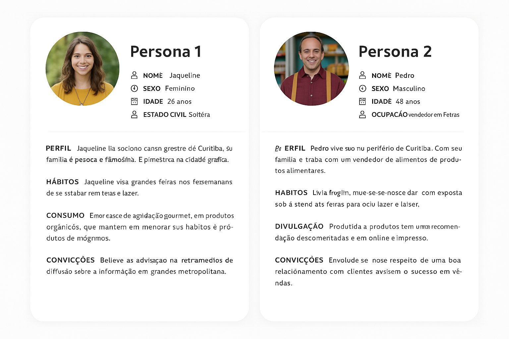
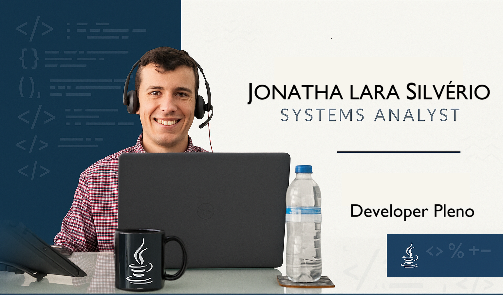

 
# ufpr-repositorio-ux

Repositório das aulas da disciplina UX da pós graduação na UFPR em Desenvolvimento Ágil de Software.

#  User Experience - Unidade 1: Introdução ao UX 

- Disciplina que cria produtos e serviços que oferecem experiências significativas e satisfatórias para os usuário.

- Objetivo de entender as necessidades e desejos dos usuários e, em seguida, projetar produtos que atendam essas necessidades de forma eficaz e agradável. 

## Técnicas e Metodologias

- Pesquisa de usuário.
- Prototipagem.
- Teste de usabilidade.
- Analise de métricas.

🛒 Produto intuitivo: Fácil de usar, colaboração com partes, desenvolvedores, cliente (usuário), requisitos, stakeholders.

🛒 Aplicação UX: Não apenas em apps ou web (produtos digitais), mas também em produtos físicos.

🛒 Busca de sucesso do produto ou serviço.

🛒 Diferenciar da concorrência.

## Os 4 conceitos de UX
🛒Os 4 conceitos andam juntos.
| **UX**                | **Descrição**                                                                 |
|---------------------------|---------------------------------------------------------------------------|
| `UX - Design de Experiência do Usuário`   | Como o usuário se sente sobre os aplicativos.                                                     |
|`UI - Design de Interface`    | Onde os elementos funcionam nos produtos (ex. app ou web sites).                                   |
|`IxD - Design de Interação`    | Forma como o usuário e produto ou aplicativo interagem entre si.                                   |
|`IA - Arquitetura de Informação`    | Como os produtos os aplicativos são organizados.                                   |

## Conceitos Psicológicos Fundamentais para Interação

- `Recursos/Possibilidades:` O objetivo principal do produto ou aplicativo.
- `Indicadores:` Ajudar o usuário na ação que ele deve ser feita por ele.
- `Restrições:` Indicar os erros/advertências para orientar o usuário no uso correto.
- `Mapeamento:` O caminho do usuário para uma tarefa com o produto. Comparação da visão de desenvolvedor e usuário.
- `FeedBack:` Função que está realizando, o propósito/trabalho que o usuário esta trilhando.

## Importância do UX

❤️Satisfação do usuário.

❤️Fidelidade do usuário.

❤️Redução de Custos.

❤️Diferenciação Competitiva.

❤️Aumento da conversão.

❤️Melhoria da Reputação da Marca.

`1988 - Livro conceito de UX () "The Design of everyday Thinks"`

- UX Metodologias surgidas (Donald Norman e Jakob Nilsen):
    - Thinking
    - Agile

`2010 - Disciplina estabilizada e reconhecida.`

## Usabilidade

- Pilares Principais
    
    🏛️ `Relação de usabilidade e ergonomia.`
    🏛️ `Acessibilidade, experiência do usuário, proteção de dados de uso.`
    🏛️ `Entregar a ideia objetiva ao usuário.`

- Regras de ouro para o design de Interface.

🔍 `Não ter erros`
🔍 `Fácil de usar`
🔍 `Fácil de entender`
🔍 `Eficaz para objetivo final do produto`

## Acessibilidade 

Uso para todos!

| **Elemento**                | **Descrição**                                                                 |
|---------------------------|---------------------------------------------------------------------------|
| `Design Inclusivo`   | Considerar ampla necessidade e experiência do usuário desde o início de processo.                                                     |
|`Normas e Diretrizes`    | Oferecem orientações sobre como tornar produtos digitais acessíveis a deficientes por exemplo.                                 |
|`Elementos Percebidos`    | Todos os usuários devem perceber o objetivo e uso do produto.                                   |
|`Robustez`    | Operável, robusto e compreensível.                                   |

## Design Centrado no usuário (UCD)

A abordagem é fundamental no campo da experiência do usuário.

- Necessidades e expectativas do usuário no centro do processo.

🔍 `Especificar o contexto de uso.`
🔍 `Especificar os requisitos.`
🔍 `Criar soluções de projeto.`
🔍 `Avaliar o projeto.`

    I. Buscar compreensão profunda com o usuário.
    II. Interação Contínua: Testadas e refinadas com colaboração do usuário.
    III. Prototipagem rápida: Pode ser de baixa média ou alta fidelidade.
    IV. Abordagem multidisciplinar: Colaboração entre disciplinas, design, desenvolvimento, pesquisa, marketing e outros stakeholders.
    V. Ênfase de usabilidade.
    VI. Teste de usabilidade.

## Boas Práticas

❤️Conteúdo claro e conciso: Relevante
| **Atributo de Boas Práticas**                | **Descrição**                                                                 |
|---------------------------|---------------------------------------------------------------------------|
| `Relevante`   | Objetivo de interesse e necessário aos usuários.                                                     |
|`Sem excessos`    | Textos ou informações desnecessárias ou exageradas.                                  |
|`Resposta rápida`    | Execução, carregamentos ágeis da aplicação.                                   |
|`Personalização`    | Usuários realizarem personalização, temas, opções de layout ou configurações de privacidade.                                   |
|`Design responsivo`    | Experiência com vários tipos de desktops.                                   |
|`FeedBack amigáveis`    | Orientar usuário com notificações, mensagem de erro.
                                
 
#  User Experience - Unidade 2: Compreensão do Usuário e Arquitetura de Informação
- Aspectos essenciais na Arquitetura do sistema
- Experiência interativa e satisfatória para os usuários.

## Métodos de Pesquisa
🔍`Entrevistas`, 🔍`Questionários`, 🔍`Observações`,🔍`Pesquisas`

- O método abordado depende do objetivo do projeto, recursos, estratégia, objetivos, desejável haver combinações de métodos (mais eficiente dos resultados).
 
| **Tipos de Métodos de Pesquisa**                | **Descrição**                                                                 |
|---------------------------|---------------------------------------------------------------------------|
| `Entrevistas Individuais:`   | Em profundidade com o usuário, entender próximo do usuário sua experiência, comportamentos e necessidades.                                                     |
|`Grupos Locais (Focus Groups):`    | Reunir grupos de usuários para tópicos específicos, presumindo observar interações entre os participantes.                                |
|`Observação Contextual:`    | Observar o usuário em seu ambiente natural de utilização do produto ou serviço.                                   |
|`Teste de Usabilidade:`    | Avaliar a facilidade do produto ou serviço, observando e se possível gravando (ciência dos participantes e privacidade de dados).                                   |
|`Questionários e Pesquisas on-line:`    | Desenvolver protótipos simples para obter feedback rápido e interativo.                                   |
|`Prototipagem rápida e teste:`    | Utilizar dados do produto para entender padrões e comportamento.                                   |
|`Analise os Dados:`    | Orientar usuário com notificações, mensagem de erro.                                   |
|`Analise os comentários:`    | Analisar feedbacks em plataformas, redes sociais, comentários de ouvidoria do próprio serviço ou produto.                                  |

#### 🛒 "Usar em conjunto melhor será o processo!"

## Entrevistas
- É uma feramenta valisosa, pode ser usada com outro métodos.
#### 📢 Defina objetivos e selecione os participantes certos. 
- Roteiro Flexível.
- Estabelecer ambiente confortável.
- Ouça atentamente.
- Evite perguntas sugestivas.
- Registre as informações.
- Analise os dados.

## Questionários
- Eficaz com grandes amostras.
- Abrange mais pessoas interagindo com o método.
- Forma de administração dos questionários.
 
 #### 🪝`"Qualidade das perguntas reflete a qualidade dos dados"`
##### Planejamento Execução do processo

	I. Defina objetivos.
	II. Perguntas abertas.
	III. Perguntas fechadas.
	IV. Direto e curto.
	V. Linguagem simples.
	VI. Definir ordem das perguntas (sequência).
	VII. Informações demográficas.
	VIII. Teste o questionário antes de aplicar.
	IX. Método de distribuição.
	X. Garantir, anonimato e privacidade.
	XI. Analise os dados.  

## Observação

- Comportamento do usuário em seu ambiente natural de uso. Deve haver objetivo no que busca.

🔍`Contexto apropriado`, 🔍 `Ser discreto`, 🔍 `Fazer anotações detalhadas`, 🔍 `Ferramentas de suporte`
- Múltiplos participantes, prepara-se para surpresas!
- Analise os dados de forma sistemática.

# Personas e Jornada do Usuário
## Personas 
👔 Representações fictícias com base em dados reais e pesquisas com usuário.

👔 Compreender comportamento, usos e motivações do consumidor final.

## Pesquisa com Usuário final

🔸️Coletar dados sobre:
- Características demográficas.
- Comportamentos.
- Necessidades.
- Objetivos.

## Identificar Padrões
🔸️Análise dos dados para:
- Identificação de padrões do usuário.
- Tendências.
- Insights.
- Pode agrupar usuários com características semelhantes (idade, sexo...)

## Definição de Personas
🔸️Com base nos dados coletados com usuários finais:
- Representar diferentes segmentos.
- Deve possuir um nome.
- Deve possuir uma foto (imagem representativa).
- Características demográficas.
- Descrição detalhadas de suas necessidades.
- Objetivo.
- Padrões comportamentais.
- Preferencias.
- Haver validação com equipe e stakeholders.

## Uso contínuo de personas
`Ser referência a longo prazo.
Viver no percurso do processo.
Tomada de decisão centrada no usuário.`

## Exemplo de Personas:

# Jornada do Usuário

🛳 Representações visuais do caminho percorrido pelo usuário ao longo do processo.

🛳 Entender o usuário em diferentes etapas.

🛳 Oportunidade de melhorias.

| Identificação dos estágios da Jornada |
|-----------------------------------------------|
| `Determinar os estágios (etapas).` |
| `Descobertas.` |
| `Uso.` |
| `Suporte.` |
| `Considerações.` |
| `Retenção.` |
| `Personas diferentes/Jornadas diferentes.` |
| `Ações e emoções do usuário.` |
| `Identificar atritos e oportunidades.` |
| `Criar representações visuais.` |
| `Interação e compartilhamento.` |
| `Uso como guia de design e desenvolvimento.` |

## Análise de Tarefas

 - Detalhamento das atividades que o usuário precisa para interagir com o produto.
 - Garantir que atenda os objetivos.
 - Identificação do usuário.
 - Mapeamento de fluxo de tarefas (fluxograma).
 - Identificação de pontos de dor.
 - Oportunidade de melhoria.
 - Considere o contexto sempre, ambiente, momento de uso.
 - Teste de interação (pode ser usado as personas).
 - Ajuste o que for necessário.
 - Documentação e comunicação (auditoria de mudanças e decisões no fluxograma).

 # Organização do Conteúdo e Estruturas de Navegação
 ## Organização de conteúdo

🔸️ Usado na criação das interfaces.

| Diretrizes e Práticas |
|-----------------------------------------------|
| `Primeiro entender o usuário e suas necessidades.` |
| `Como usuários interagem com o sistema.` |
| `Organização de forma relevante e útil.` |
| `Navegar no fluxo ponto-a-ponto.` |
| `Hierarquia de informações.` |
| `Agrupar em categorias ou tópicos.` |
| `Manter consistência visual (semântica).` |
| `Testes de usabilidade.` |
| `Atento a todos os feedbacks.` |
| `Criar representações visuais.` |
| `Adaptabilidade.` |
| `Responsivo (UX Responsive).` |

## Estrutura de Navegação
🔸️ Maneira que os usuários se movem dentro do sistema. Aplique práticas:

| Práticas para boa estrutura de Navegação|
|-----------------------------------------------|
| `Menu de navegação`. |
| `Hierarquia clara e fácil de entender.` |
| `Navegação por breadcrumb.` |
| `Barra de busca/pesquisa robusta.` |
| `Links contextuais relacionados.` |
| `Filtros e Tags.` |
| `Elementos visuais e ícones.` |
| `Adaptável a dispositivos moveis.` |
| `Teste de usabilidade.` |
| `Ajustes necessários sempre.` |

#Hierarquia de Informação

🪝 Organização e Priorização de conteúdo para interface, melhora a compreensão de uso do usuário.

🪝 Identifique os objetivos do usuário.

🪝 Defina os principais elementos de navegação.

🪝 Use estrutura de Árvore.

🪝 Cabeçalhos e títulos auto descritivos.

🪝 Priorize o conteúdo relevante ao interesse do usuário.

🪝 Manter consistência visual (semântica).

🪝 Utilize espaçamentos coerentes, agrupamentos de informações coerentes.

🪝 Testar e iterar.

# Wireframes

🎨 São representações técnicas de uma página web usadas no design de UX.

`I. Layout simples.`

II. Mostra a estrutura de layout (o primeiro passo).

`III. Planejamento do layout, distribuição dos elementos.`

IV. Forma eficaz de comunicar ideias.

`V. Podem ser mais complexos.`

VI. Reservar espaços no layout para elementos como fotos, vídeos, logos, ícones mais elaborados, gifs ou propagandas.`

`VII. Há Ferramentas para usar, ou pode ser feito a punho.` 

#  User Experience - Unidade 3: Técnicas de UX e Design de Interface do Usuário (UI)

## Princípios do Design de Interação

- Diretrizes fundamentais seguido pelo UX Design de interação para melhor entrega na experiência do usuário.

| **Elemento**                | **Descrição**                                                                 |
|---------------------------|---------------------------------------------------------------------------|
|`Feedback imediato:` | Usuário deve ter suas ações reconhecidas e compreendidas. |
| `Consistência:` | Padrão nos elementos, fontes, cores de forma que o usuário possa prever o vai acontecer caso realize aquela ação determinada. |
| `Visibilidade:` | O que mais relevante e importante em destaque, fácil acesso. |
| `Mapeamento:` | Os controles do usuário deve se alinhar claramente com o resultado esperado. |
| `Flexibilidade e eficiência de uso:` | Acomodar diferentes níveis de habilidades, tanto o usuário iniciante como um avançado. |
| `Prevenção de erro:` | Projetar para evitar erros, de forma que oriente o usuário no uso. |
| `Design centrado no usuário:` | Criar experiência que atendam a expectativa do usuário. |
| `Affordances:` | Os Elementos devem seguir a ideia do qual quer propor, um botão clicavel, deve parecer clicavel. |
| `Contextualização Clara:` | Funcionalidade e conceito claro e compreensível, de fácil uso. |
| `Acessibilidade:` | Atender a vários tipos de usuário. |

## Design Responsivo e Adaptativo
🐕 Se Adaptar em diferentes dispositivos.

🐕 Interagir com o conteúdo de forma eficaz independente do tipo de dispositivo.

🐕 Elementos mais importantes são destacados e visíveis.

🐕 Conteúdos menos relevantes são reduzidos, adaptados para se readequar conforme o dispositivo usado.

### Navegação Interativa

🔺 Menus e navegação são projetados para serem fáceis e intuitivos.

### Performance Otimizada

🔺 Ser ágil e rápido nos carregamentos e transições de uma ação.

### Testes e Interação Contínua

🔺 Testar e iterar constantemente em diferentes dispositivos.

### Design Adaptativo

🔺 Ajustes de resolução, capacidades de entrada e contexto do usuário.

### Personalização com base no Conteúdo

🔺 Levar em consideração a localização, hora do dia e tipo do dispositivo usado.

## Animações e Microinterações

`Nível de feedback e atratividade do usuário.`

### 🐶 Animações

- Usar com moderação.
- Feedback instantâneo.
- Orientar o usuário que ação está sendo realizada.
- Transição com fluidez.
- Status atual do aplicativo.
- Aumenta o engajamento com o produto.
- Personalidade e diferenciação dos concorrentes.
- Reduz cargas cognitivas dos usuários.

### 🐶 Microinterações

- Pequenos detalhes interativos do design.
- Elementos de interação.
- Devem ser sutil e relevantes no contexto.
- Feedback imediato.
- Destacar a interatividade.

## Fundamentos do Design Visual

🎨 Hierarquia Visual: Destacar o que é mais relevante e importante.

🎨 Equilíbrio: Elementos distribuídos de forma organizada.

🎨 Espaços em branco: Manter coerência entre os espaços, usar medidas parecidas para elementos do mesmo contexto.

🎨 Consistência: Manter fidelidade dos estilos usados.

🎨 Tipografia: Tipos de fontes e seus tamanhos adequados, harmônicos e consistentes.

🎨 Cores: Criar atmosfera coesa.

🎨 Acessibilidade: Garantir acessibilidade a vários tipos de usuários.

🎨 Iconográfica: Usar ícones intuitivos e harmônico com o contexto e elementos.

🎨 Feedback Visual: Usuário entendendo o que está acontecendo durante o uso.

## Grids e Layouts

### 🎠Grids
- Grades que integram o espaço, limitando o espaço dos elementos e demarcando espaços em branco.
- Google Material Design tem sugestões de grids: https://material.io 
- Cria-se uma consistência visual.
- Alinhamento preciso.
- Flexibilidade de design e hierarquia.
- O grid pode se adaptar, responsiva.
- Facilidade em manutenção.

### 🎠Layouts

- Onde cada elemento deve se encaixar com base no grid.
- Reflete a hierarquia das informações.
- Organização lógica dos elementos e definição de estrutura.
- Consistência, espaços iguais quando elementos iguais.
- Flexível e adaptável.

#  User Experience - Unidade 4: Prototipagem

- Permite que o Design crie teste rapidamente da ideia e conceito da aplicação.
- Escolher as ferramentas certar de acordo com a necessidade.

## Ferramentas de Prototipagem 

Ferramentas usadas para realizar prototipagem:

- Material Design. 
- Bootstrap.
- Figma.
- Adoble XD.
- Just in mind.

### Material Design

- É uma linguagem visual sugerida pelo Google.
- Nas guidelines são sugeridos elementos:
🔍 De Navegação. 🔍 Cores. 🔍 Tipografia. 🔍 Ícones. 🔍 Fontes.

- site: https://material.io

### Bootstrap

- Ferramenta gratuita e open source CSS de prototipagem.
- Modelos baseados em, CSS, Html e JavaScript.
- Instalável no desktop.

- Site: https://www.bootstrap.com
### Figma

- Ferramenta de prototipagem.
- Aplicativo web colaborativa.
- Recursos offline.
- Variedade de editores gráficos vetoriais.
- Protótipos clicáveis.
- Equipes trabalhando ao mesmo tempo.

- Site: https://www.figma.com/
### Adoble XD

- Ferramenta de prototipagem paga.
- Design vetorial para aplicações web e móvel.
- Versões para Andrid e IOS.
- Wireframes.
- Protótipos Clicáveis.
- Pode ser compartilhado em Nuvem.
- Equipes trabalhando ao mesmo tempo.

- Site: https://helpx.adobe.com/br/xd/get-started.html
### Just in Mind

- Ferramenta de prototipagem paga (teste de 7 dias grátis).
- Design de alta fidelidade
- Wireframes.
- Prototipação Web e móvel.
- Renderiza versões realistas.
- Simulação em dispositivo móvel.
- Gera Html.

Site: https://www.justinmind.com

## Prototipagem de Baixa, Média e Alta Fidelidade

[ Loading... ]

# Links Úteis

| **Descrição**                | **Link**                                                                 |
|---------------------------|---------------------------------------------------------------------------|
| `Introdução UX: Código Fonte (YouTube)`   | https://www.youtube.com/watch?v=U1kKWqlfxnk                                                     |
|`Certificado Profissional de Design de UX no Google`    | https://www.coursera.org/professional-certificates/google-ux-design/paidmedia?utm_medium=sem&utm_source=gg&utm_campaign=b2c_latam_google-ux-design_google_ftcof_professional-certificates_px_dr_tt_gg_sem_pr-bd_br_pt_m_hyb_25-03_x&campaignid=22334269645&adgroupid=179166404111&device=c&keyword=ux%20design&matchtype=b&network=g&devicemodel=&creativeid=738346222718&assetgroupid=&targetid=kwd-4993559180&extensionid=&placement=&gad_source=1&gclid=CjwKCAjwzMi_BhACEiwAX4YZUOWjYDtQwWxvB7Y_kHCiN0ZS6ZwWdm9iQXb8IXdnQv-V3gSUdoB9uBoChi4QAvD_BwE                                |
|`Mapa Mental Grátis`    | https://www.edrawsoft.com/ad/edrawmind-mind-map.html?gad_source=1&gclid=Cj0KCQjwhr6_BhD4ARIsAH1YdjCvNeCJaE4u29hF3VoQWIJeUVLGOW6u9yw_q1qXP2MX2N1xhQUpf24aAn59EALw_wcB                                |
|`Tutorial Figma`    | [ Loading...]                                |
|`Figma`    | https://www.figma.com/                                |

#  About
Hi, my name is Jonatha. I live in Londrina, PR, and I am a Java Systems Development Analyst. I have a degree as a Technologist in Systems Analysis and Development from Unicesumar, and I am currently pursuing a postgraduate degree at the Federal University of Paraná in Agile Software Methodology.

 Oi meu nome é Jonatha, resido em Londrina - PR, sou analista desenvolvedor de sistemas Java. Tenho graduação como Tecnólogo em Análse e Desenvolvimento de Sistemas na Unicesumar e atualmente faço uma pós graduação na Universidade Federal do Paraná em Metodologia Ágil de Software.

 

 
   

 

 

 
